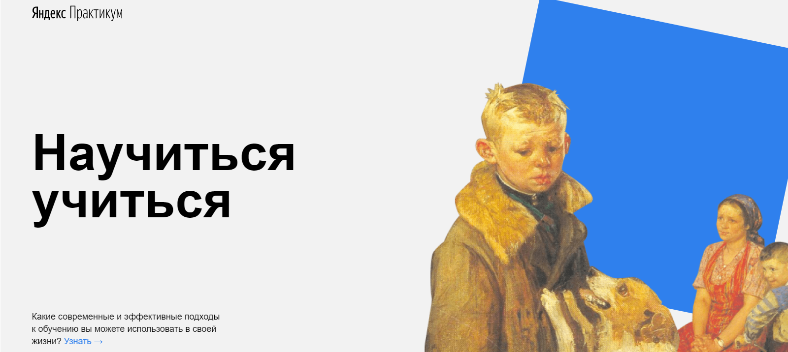

# Как научиться учиться #

## О проекте

Проект содержит техники, принципы и методы обучения, интересные цифры и факты, полезные ссылки на порталы, а также интересные видео для любителей прокрастинировать. Реализован без подключения сторонних библиотек и JS. Были использованы фексбоксы, позиционирование, анимация и семантические теги. Файловая структура организована по БЭМ.

### Стек:
* HTML
* CSS
* БЭМ
* Анимация
* Iframe

## Что хочется добавить в проект в будущем ##
* Адаптивность проекту для мобильных экранов и планшетов с помощью медиа-запросов (без изменений в html-разметке).
* Форму обратной связи, чтобы пользователи могли отправлять свои комментарии.

Макет предоставлен: _Я.Практикум_.

[Ссылка на проект в GH Pages](https://dariy-iva.github.io/how-to-learn/)
